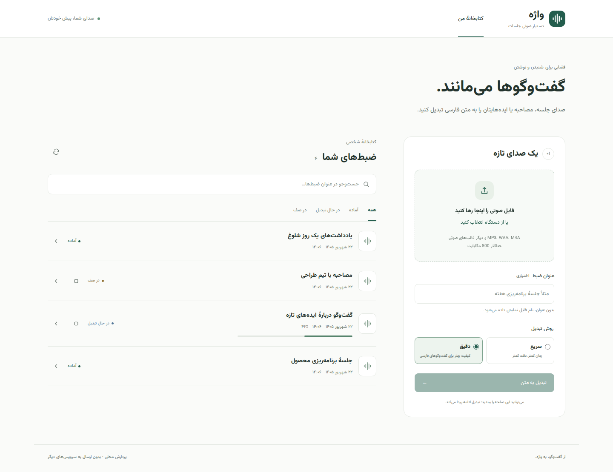

# واژه · Voice to Text

**Offline Persian meeting transcription, on your CPU.**

Upload a recording, give it an optional title, and turn it into readable Persian
text. A responsive RTL interface keeps your recordings organized, with search,
progress, audio playback, timestamps, and downloadable transcripts.



## Features

- Persian RTL interface and locally bundled Vazirmatn fonts; no frontend CDN.
- CPU inference with faster-whisper / CTranslate2 and int8 model support.
- Background queue, progress, cancellation, and retry.
- Cancellation stops the processing subprocess, including native inference.
- Optional titles, recording search, and status filters.
- Persian normalization, optional speaker diarization, and Silero VAD.
- TXT, Word, SRT, VTT, and JSON exports.
- Offline runtime after dependencies and models have been prepared online.

## Documentation

| Guide | Contents |
| --- | --- |
| [Setup](docs/SETUP.md) | Local installation, model preparation, testing without a model |
| [Deployment](docs/DEPLOYMENT.md) | Docker Compose, offline deployment, HTTPS, backup, upgrades |
| [Configuration](docs/CONFIGURATION.md) | CPU/memory sizing, model tiers, storage and queue settings |
| [Visual architecture](docs/arcetecture.md) | System, processing, cancellation, lifecycle and deployment diagrams |
| [Architecture and API](docs/ARCHITECTURE.md) | Pipeline, cancellation, endpoints and limitations |
| [Contributing](CONTRIBUTING.md) | Development environment and tests |
| [Changelog](CHANGELOG.md) | Release history |

## Quick start: Docker demo

Requires Linux, Docker Engine with Compose, and at least 4 logical CPU cores.
The demo emits **fabricated text** to exercise the interface; it does not transcribe.

```bash
git clone https://github.com/MMDBadCoder/voice-2-text.git
cd voice-2-text
cp .env.example .env
mkdir -p data models
sudo chown 10001:10001 data
ASR_BACKEND=stub docker compose up -d --build --scale worker=1
```

Open **http://127.0.0.1:8000**. Upload a short audio file to try the complete flow.

For actual Persian transcription, follow [Setup](docs/SETUP.md) to obtain a model,
then start Compose without the `ASR_BACKEND=stub` override. The default
configuration selects the accurate model provided by the download script.

The application has **no built-in authentication or per-user isolation**. Keep it
on localhost or a trusted private network; use an authenticated HTTPS reverse
proxy when exposing it to others. All connected users share one library.

## Requirements

- Linux (including a Linux VM or WSL2); process-group cancellation uses POSIX signals.
- Python **3.11** for a source installation, plus Redis.
- CPU with a compatible CTranslate2 wheel; no GPU or PyTorch required at runtime.
- Start with 8 GB RAM for one accurate-model worker. Tune against your workload.
- Space for models, dependencies and uploads; the accurate model is about 1.6 GB,
  with about 0.82 GB additional storage for the optional converted turbo tier.

Models are loaded per recording and released afterward. This adds startup cost
but makes cancellation prompt and prevents idle workers retaining model memory.
Accuracy and speed depend on the model, recording, and machine; review important
transcripts against the source audio.

## Development

```bash
python3.11 -m venv .venv
.venv/bin/python -m pip install -r requirements-dev.txt
.venv/bin/python -m pytest -q
```

Tests use temporary storage and a stub ASR backend. See
[Contributing](CONTRIBUTING.md) for details.

## License and credits

Application code: [MIT](LICENSE). Fonts: [SIL Open Font License](app/static/fonts/OFL.txt).
Model weights are downloaded separately and remain subject to their own licenses.

Built with [FastAPI](https://fastapi.tiangolo.com/),
[faster-whisper](https://github.com/SYSTRAN/faster-whisper),
[CTranslate2](https://github.com/OpenNMT/CTranslate2), and [RQ](https://python-rq.org/).
Design references: [UI UX Pro Max](https://uupm.cc/#styles) and
[Impeccable](https://impeccable.style/).
