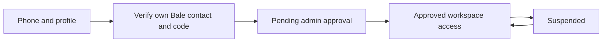
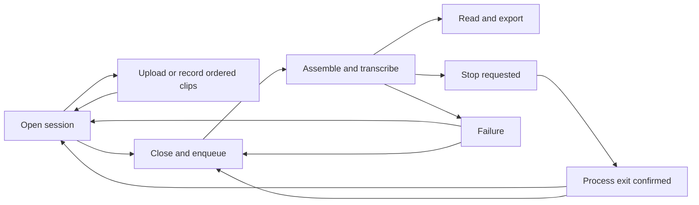

# Accounts and recording sessions: product and implementation design

## Experience

The private workspace has two primary destinations: sessions and account settings.
An administrator additionally sees user approvals. The existing Persian typography,
quiet green palette and RTL layout remain, with a clearer distinction between an
editable session and a completed transcript.

### Account journey

1. Sign up with a full name, an 11-digit Iranian mobile number (`09` + 9 digits),
   and a password. Persian/Arabic digits are normalized before validation.
2. Request a six-digit verification code. First-time users open the Bale bot using
   a short-lived link and share their own contact with its contact-request button.
   The contact must belong to the message sender and match the entered number.
3. Enter the code in the app. Registration creates a pending account.
4. A dedicated waiting screen explains that an administrator must approve access.
5. After approval, the user can create sessions in a private workspace.

Login offers password or Bale code. Forgotten passwords use a Bale code, while
signed-in password changes require the current password. Password replacement
revokes existing login sessions. Pending and suspended users cannot access work.

Bale credentials and bootstrap admin credentials are private environment values.
The existing library migrates to the configured administrator, never to a newly
registered user. Admin access manages accounts, not other users' private audio.

### Session journey

The library shows a primary “new session” action and filters for open, processing
and completed sessions. A new session starts with a title and transcription tier.
Its editor contains an ordered list of audio clips and an add-audio area with two
choices: upload files or record in the browser. Users can preview, remove and
reorder clips while the session is open. Successfully uploaded clips persist
across page reloads. An unsaved browser recording stays explicitly marked local.

The recorder shows microphone state, elapsed time, stop/discard and preview/save.
MP3 encoding happens locally in a Web Worker after recording stops. The app
uploads the resulting MP3 only when the user saves it to the session. Microphone
access requires HTTPS or localhost. Individual browser recordings have a time
limit to bound browser memory; users can append more clips afterward.

“Close session and generate text” confirms the clip order, locks editing and queues
the complete session. A single supervised process builds a continuous audio file
and transcribes it with cumulative timestamps. Cancellation stops the full
process, including audio assembly. Closed/failed sessions can retry; no clip may
be added while processing. A stopped/failed session can be reopened for editing
once the previous process has exited, invalidating stale generated output.

## States

## Data and boundaries

- Users: unique phone, full name, Argon2 password hash, approval state and admin role.
- Login sessions: random opaque cookie, server-side token hash, expiry and CSRF token.
- Bale identities: phone mapped to the verified Bale user and private chat.
- Verification challenges: purpose, expiry, limited attempts and a hashed code.
- Jobs: session title, owner, open/processing state and existing transcript metadata.
- Clips: parent session, stored filename, original name, sequence and size.
- Admin actions: approval/suspension audit with actor and timestamp.

Every recording, clip, transcript, export and audio endpoint requires ownership.
Workspace use also requires approval. Cookies are HttpOnly and SameSite=Lax;
mutations require CSRF validation. OTP requests and password attempts are rate
limited. Verification codes expire, have attempt limits and cannot be replayed or
used for a different purpose. No account, phone, code or secret is put into Git.

Session mutations serialize with close operations to prevent uploads or order
changes racing with a closed session. File writes are cleaned up when a final
state check rejects an upload. Background processes keep their existing killable
process-group boundary. Bale runs as a separate long-polling service; only account
verification needs an external connection. Audio never goes to Bale.

## Validation

Exercise account state transitions, phone normalization, OTP expiry/replay/attempts,
Bale contact identity mismatches, login/session revocation, CSRF, cross-user access,
admin-only actions and migration of the existing library. For sessions exercise
multi-format clips, order, close/edit races, cancellation, retry/reopen, and full
combined output. Browser checks cover desktop/mobile, pending/admin screens,
microphone permission failures, local MP3 encoding and upload recovery.

References: [Bale Bot API](https://docs.bale.ai/),
[MDN microphone permissions](https://developer.mozilla.org/en-US/docs/Web/API/MediaDevices/getUserMedia),
and [OWASP password storage](https://cheatsheetseries.owasp.org/cheatsheets/Password_Storage_Cheat_Sheet.html).

### Verified implementation

The implementation passes 66 automated tests covering accounts, isolation,
verification codes, approval, sessions, races, exports and process cancellation.
A browser acceptance run exercised signup, approval, desktop/mobile layouts,
ordered uploads, microphone capture, actual MP3 encoding, session processing and
password change. A live two-clip session completed through the installed model,
including combined playback and transcript export. The real Bale bot responds
and its poller starts; an actual user must still complete contact sharing to
validate delivery through their Bale client. Remote microphone access requires
an HTTPS domain configured by the operator.
