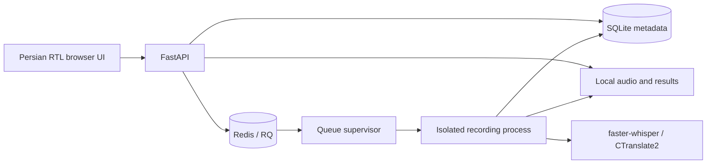

# Architecture and API

For detailed system, sequence, lifecycle and deployment diagrams, see the
[visual architecture guide](arcetecture.md).



An open session stores ordered clips without queuing. Closing it locks editing
and queues assembly and transcription. The legacy single-upload API queues immediately. A supervisor
atomically claims the job and starts a fresh Python interpreter in its own POSIX
process group. The child probes audio, loads a local model, transcribes and
normalizes Persian text, optionally assigns speaker labels, and writes an atomic
JSON result. The browser polls metadata; exports derive from the stored result.

## Cancellation

The API marks cancellation, and the supervisor checks the database and Redis
every 200 ms. It kills the owned processing group and waits for the direct child
to exit before confirming stopped. This interrupts native inference without
waiting for a segment boundary. Model memory is released with the child.

The public job status remains `canceled` while its `stage` is `canceling` until
exit is confirmed. The UI displays “stopping,” keeps polling, and blocks retry.
A queued cancellation prevents a successful supervisor claim. Duplicate queue
deliveries cannot claim a job already running or completed. Conditional SQL
prevents late progress/done callbacks from reviving canceled jobs.

This is not host-crash recovery. A killed supervisor or system outage can leave
stale metadata. Backups and process supervision remain operator responsibilities.

## HTTP API

Interactive API documentation: `/docs`. OpenAPI schema: `/openapi.json`.
Workspace APIs require a session cookie and approved account; mutations also
require `X-CSRF-Token`. Every recording lookup enforces ownership, including for
administrators. See [account API usage](ACCOUNTS_SETUP.md#api-clients).

| Method | Path | Purpose |
| --- | --- | --- |
| `POST` | `/api/jobs` | Multipart `file`, optional `title` (max 200 characters), optional `tier`. |
| `GET` | `/api/jobs` | List with `limit` (1–200), `offset`, `status`, `search`. |
| `GET` | `/api/jobs/{id}` | Status, stage, progress and metadata. |
| `GET` | `/api/jobs/{id}/segments` | Transcript segments and source metadata. |
| `GET` | `/api/jobs/{id}/audio` | Original audio if retained. |
| `GET` | `/api/jobs/{id}/download?format=txt` | `txt`, `plain`, `docx`, `srt`, `vtt`, `json`. |
| `POST` | `/api/jobs/{id}/cancel` | Cancel queued/running processing while keeping the recording row. |
| `POST` | `/api/jobs/{id}/retry` | Requeue failed/stopped jobs when audio still exists. |
| `DELETE` | `/api/jobs/{id}` | Stop processing and delete recording, source audio and canonical result. |
| `GET` | `/api/health` | Operational queue, model, CPU, job and disk information. |
| `GET` | `/healthz` | API liveness; does not prove workers or models are ready. |

Example (after login, with saved cookie and CSRF token):

```bash
curl -b cookies.txt -H "X-CSRF-Token: $CSRF_TOKEN" -F 'file=@meeting.mp3' \
     -F 'title=جلسهٔ هفتگی' \
     -F 'tier=accurate' \
     http://127.0.0.1:8000/api/jobs
```

A blank title falls back to the original filename. Titles are stored, searchable,
and used for export filenames. Startup adds the nullable title column to older
databases without replacing existing recordings.

## Account and session endpoints

| Method | Path | Purpose |
| --- | --- | --- |
| POST | `/api/auth/challenges` | Request a purpose-bound Bale verification challenge. |
| POST | `/api/auth/signup` | Verify code and create pending account. |
| POST | `/api/auth/login/password`, `/api/auth/login/bale` | Start an authenticated session. |
| POST | `/api/auth/password/reset`, `/api/auth/password/change` | Recover or change password and revoke previous logins. |
| GET | `/api/auth/me` | Current account and CSRF token. |
| POST | `/api/auth/logout` | Revoke current login. |
| GET | `/api/admin/users` | Administrator account search and pagination. |
| POST | `/api/admin/users/{id}/status` | Approve, suspend or return account to pending. |
| POST | `/api/sessions` | Create an open titled session. |
| GET, POST | `/api/sessions/{id}/clips` | List or upload clips. |
| GET | `/api/sessions/{id}/clips/{clip_id}/audio` | Private clip playback. |
| DELETE | `/api/sessions/{id}/clips/{clip_id}` | Remove an open session's clip. |
| POST | `/api/sessions/{id}/order` | Set the complete ordered clip ID list. |
| POST | `/api/sessions/{id}/close` | Lock editing and queue processing. |
| POST | `/api/sessions/{id}/reopen` | Edit a failed or fully stopped session. |

## Known limits

- Linux/POSIX process management; native Windows is unsupported.
- No streaming transcript; transcription starts when a session closes.
- Browser microphone access requires HTTPS or localhost; each capture is limited to ten minutes.
- Progress advances at decoder segment boundaries; it is not an ETA.
- No built-in supervisor-crash recovery or transactional database/queue enqueue.
- Optional diarization is not covered by automated model-free tests.
- SQLite on a single host is the supported storage arrangement.
