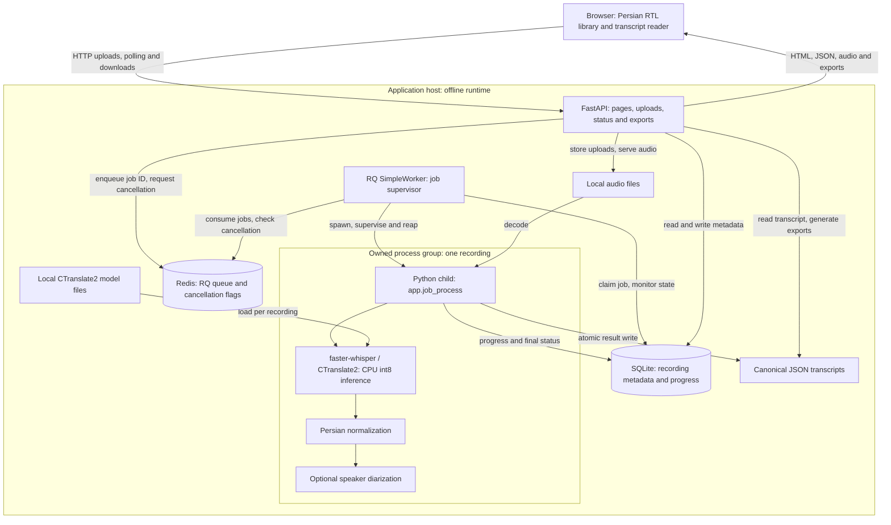
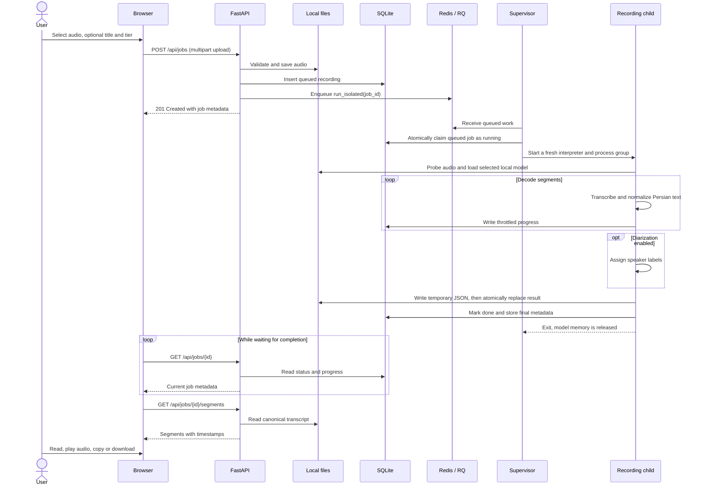
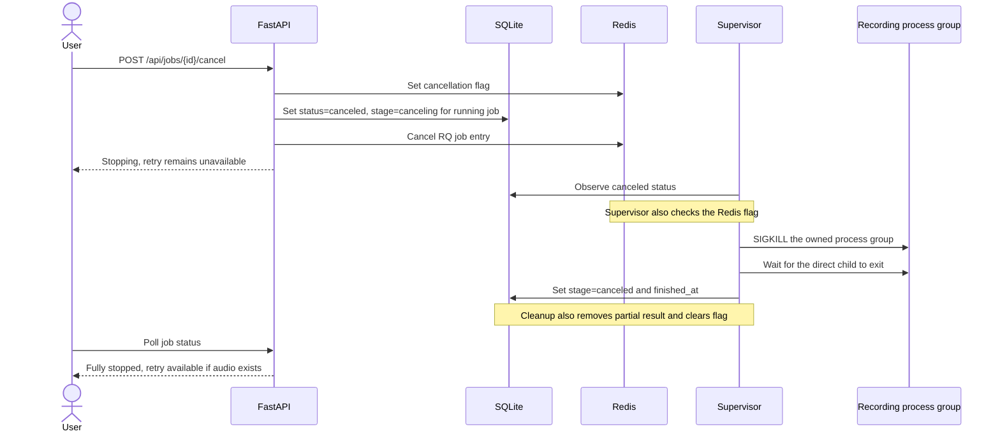
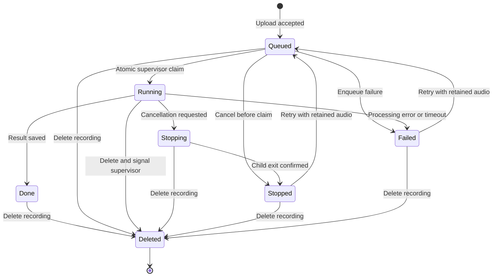
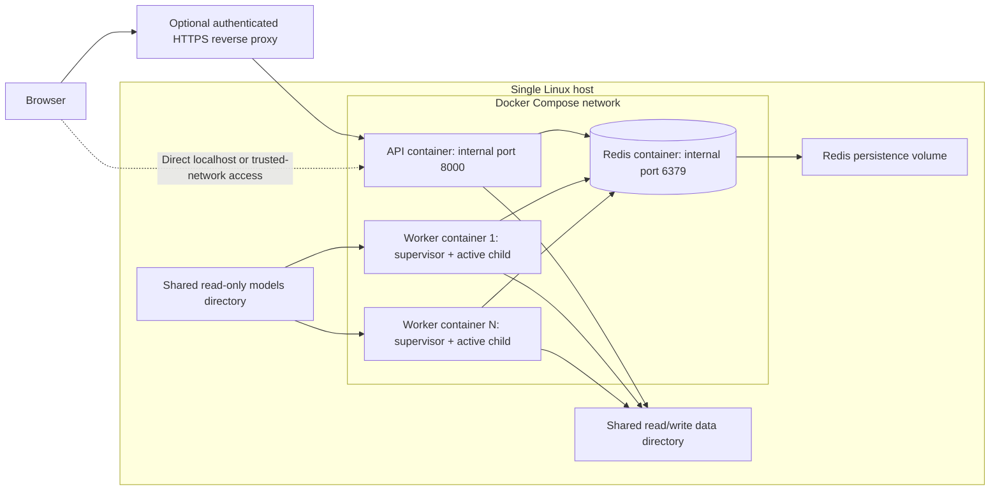

# Visual architecture

Voice to Text (واژه) is a single-host, offline Persian transcription application.
FastAPI serves the web interface and manages recordings; Redis/RQ schedules work;
a separate child process performs CPU inference for each recording. SQLite and
local files preserve the library across application restarts.

The diagrams describe the current implementation. GitHub renders the Mermaid
blocks directly. See [Setup](SETUP.md), [Deployment](DEPLOYMENT.md),
[Configuration](CONFIGURATION.md), and the [API reference](ARCHITECTURE.md)
for commands, settings and endpoint details.

## 1. System overview



The API accepts uploads without waiting for transcription. Audio bytes and model
weights stay in local storage; the queue carries a job identifier. The browser
polls job metadata rather than keeping a long-running transcription request open.
Fonts, styles and JavaScript are bundled locally, so the runtime needs no CDN.

## 2. From upload to transcript



Polling also occurs while the child is decoding; its placement after completion
in the diagram keeps the two flows legible. Progress writes are usually throttled
to one update per 1.5 seconds and depend on decoder segment boundaries. Model
loading and the first segment can take time before measurable progress appears.
The displayed percentage is not a completion-time estimate.

TXT, plain text, SRT, VTT and JSON exports are generated from the canonical result.
Word output is generated into a local `.docx` file. Source audio remains available
for playback unless retention settings or deletion have removed it.

## 3. Cancellation and resource ownership



The supervisor normally checks every 200 ms; this is a polling interval, not a
hard end-to-end latency guarantee. It can stop native decoding, audio probing and
diarization without waiting for the next segment. Cooperative checks in the
transcription code provide a secondary cancellation path.

A running cancellation has two observable phases:

| API status | API stage | Meaning |
| --- | --- | --- |
| `canceled` | `canceling` | Stop requested; the supervisor has not yet confirmed exit. |
| `canceled` | `canceled` | Stopped; a retry can proceed if source audio remains. |

Each supervisor handles one recording at a time. Its child owns the loaded model
and inference threads. A fresh interpreter avoids forking an already initialized
native inference runtime. This design reloads the model for each recording, but
releases its memory after completion or cancellation. Idle supervisors hold no
warm model cache.

Deleting a recording also signals cancellation. The API removes its row, audio
and canonical result; the supervisor treats a missing row as a reason to stop.
The normal cancel action keeps the recording row and source audio for retry.

## 4. Recording lifecycle



`Stopping`, `Stopped` and `Deleted` are conceptual labels: stopping/stopped both
use API status `canceled`, while deletion removes the database row entirely.
Deletion during processing still requires the supervisor to terminate the child.

An atomic `queued` → `running` database update prevents duplicate queue deliveries
from starting a second decoder for an already claimed job. Conditional updates
prevent late progress or completion callbacks from reviving canceled recordings.
Database writes, queue operations and file writes are separate operations; the
whole pipeline is not one cross-system transaction.

## 5. Deployment topology



The local launcher uses the same API and worker modules as separate host
processes. Docker Compose packages them as containers with per-service resource
limits. Set `--scale worker=N` to match `WORKER_COUNT`; the application enforces:

```text
WORKER_COUNT × WORKER_CPU_THREADS <= logical cores − RESERVED_CORES
```

More workers allow simultaneous recordings and multiply inference memory usage.
SQLite and uploaded files are shared locally; a multi-host cluster is not the
documented deployment. Redis is internal to the Compose network, while the API
port is published on the address configured by `HOST` and `PORT`.

## 6. Storage and code map

| Responsibility | Implementation | Durable data |
| --- | --- | --- |
| Pages, API and upload orchestration | [`app/main.py`](../app/main.py) | Recording metadata via the database |
| RTL interface, polling and reading controls | [`app/templates/`](../app/templates/), [`app/static/app.js`](../app/static/app.js) | None in the browser required for job execution |
| Configuration and CPU budget | [`app/config.py`](../app/config.py) | Private `.env` deployment settings |
| Metadata and additive schema migration | [`app/db.py`](../app/db.py) | `data/jobs.db` |
| Upload validation and filenames | [`app/storage.py`](../app/storage.py) | `data/audio/<job-id>.<extension>` |
| Queue and cancellation flags | [`app/queue.py`](../app/queue.py) | Redis queue state |
| Worker startup | [`app/worker.py`](../app/worker.py) | None |
| Claim, supervision, cleanup and transcription task | [`app/tasks.py`](../app/tasks.py) | Job status and result metadata |
| Child process entry point | [`app/job_process.py`](../app/job_process.py) | None |
| Model loading and inference | [`app/asr.py`](../app/asr.py) | Preinstalled model files under `models/` |
| Text cleanup and speaker labels | [`app/normalize.py`](../app/normalize.py), [`app/diarize.py`](../app/diarize.py) | Normalized segments in the canonical result |
| Atomic transcript persistence | [`app/results.py`](../app/results.py) | `data/results/<job-id>.json` |
| Download generation | [`app/exporters.py`](../app/exporters.py) | Word exports may be cached locally |

SQLite stores titles, filenames, sizes, model tiers, status, progress, timing and
summary counts. JSON stores transcript segments, timestamps, language and result
metadata. An optional title is separate from the original and stored filenames;
a missing title falls back to the original filename in the UI.

## 7. Operational boundaries

The application uses approved accounts and owner-scoped sessions. Administrators
manage access but cannot read other users’ audio. Use HTTPS for remote access. Online preparation downloads dependencies
and weights; transcription uses the installed local files.

The supervisor handles normal cancellation and task failures, but there is no
complete recovery mechanism for host crashes or a supervisor killed unexpectedly.
`/healthz` checks API liveness; `/api/health` reports queue, worker and resource
information without proving that a particular model can transcribe successfully.
Keep backups and validate models on the target machine. See the
[known limits](ARCHITECTURE.md#known-limits) and
[deployment guide](DEPLOYMENT.md) for retention and recovery considerations.

## 8. Accounts and multi-clip sessions

```mermaid
flowchart LR
    Browser --> Auth[Cookie authentication and CSRF]
    Auth --> Approval[Admin approval and ownership checks]
    Approval --> Session[Open session]
    Session --> Clips[Ordered uploads and browser MP3 recordings]
    Clips --> Close[Close and lock session]
    Close --> Queue[Redis queue]
    Queue --> Child[Isolated assembly and ASR process]
    Child --> Result[Combined audio and transcript]
    Browser --> Challenge[Phone and purpose-bound challenge]
    Challenge --> Bale[Bale bot contact verification and code]
    Bale --> Account[Signup or login or password reset]
    Account --> Auth
```



SQLite now also holds users, hashed login tokens, verification challenges, Bale
identities, rate limits, approval audit records and ordered audio clips. Existing
unowned jobs are assigned to the bootstrap administrator during migration.
Open sessions do not consume worker resources. Closing streams their clips into
one MP3 before the existing transcription pipeline. Cancellation covers assembly
and inference in the same owned process group.

See [design and lifecycle diagrams](ACCOUNTS_AND_SESSIONS.md) and
[configuration and deployment](ACCOUNTS_SETUP.md).
